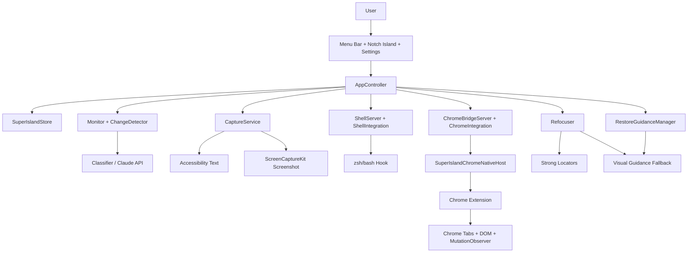

# SuperIsland Architecture and Feature Map

Generated: 2026-06-10 01:48:07 IST  
Branch: `codex-restore-strategy`

## Product Summary

SuperIsland is a native macOS menu-bar app for bookmarking in-progress work.

The user can "drop a superisland" on the current app or browser tab, move on to other work, and later use the SuperIsland island or menu-bar list to return to the exact task. SuperIsland also monitors the target and updates status as the task moves between working, done, needs attention, stale, and unknown.

The current strategy is:

1. Prefer strong integrations whenever available.
2. Use app-specific adapters when they are reliable.
3. Use generic visual guidance only for weak or unknown apps.
4. Keep visual guidance suggestive and user-confirmed.

## High-Level Architecture



## Code Layout

### `Sources/SuperIslandCore`

Pure Swift domain and protocol logic.

- `Models.swift`: core entities such as `SuperIsland`, `WindowTarget`, `Locator`, `SuperIslandStatus`, and `StatusEvent`.
- `SuperIslandStore.swift`: owns the superisland list, persistence, ordering, and status updates.
- `ChangeDetector.swift`: detects changes and settle periods before evaluation.
- `Classifier.swift`: Claude-backed status classification and response parsing.
- `Backoff.swift`: retry/backoff policy.
- `IntegrationRouter.swift`: decides which locator types are strong and which allow visual restore.
- `ChromeBridgeProtocol.swift`: JSON-RPC-style tools, responses, events, tab state, DOM summaries.
- `ChromeBridgeStateStore.swift`: in-memory bridge state for Chrome tabs, DOM summaries, statuses, and queued commands.
- `ChromeNativeHostManifest.swift`: generates Chrome native messaging host manifests.
- `RestoreMemory.swift`: local restore memory model and visual anchor matching.
- `ShellHookScriptBuilder.swift`: generates zsh and bash shell hook scripts.

### `Sources/SuperIslandApp`

macOS app implementation.

- `SuperIslandApp.swift`: app entry point, menu-bar extra, settings scene, and environment wiring.
- `AppController.swift`: central coordinator for dropping superislands, monitoring, shell events, Chrome bridge state, restore memory, and refocus.
- `Views.swift`: menu, settings, onboarding, superisland list, and integration UI.
- `NotchIsland.swift`: floating notch-style island window.
- `Adapters.swift`: generic, Chrome, Terminal, iTerm, shell, and refocus adapters.
- `CaptureService.swift`: Accessibility and screenshot capture.
- `Monitor.swift`: periodic and change-driven status evaluation.
- `Permissions.swift`: Screen Recording, Accessibility, and Automation permission helpers.
- `Settings.swift`: persisted app settings.
- `HotkeyService.swift`: global hotkey support.
- `ServicesProvider.swift`: macOS Services integration.
- `ShellServer.swift`: local HTTP receiver for shell events.
- `ShellIntegration.swift`: installs zsh/bash scripts and source blocks.
- `ChromeBridgeServer.swift`: local HTTP bridge used by the native host.
- `ChromeIntegration.swift`: Chrome extension and native host setup helper.
- `RestoreVisual.swift`: encrypted visual restore memory, AX/OCR anchors, and highlight overlay.

### `Sources/SuperIslandChromeNativeHost`

Chrome native messaging helper.

- Reads length-prefixed JSON messages from Chrome.
- Forwards them to SuperIsland over `http://127.0.0.1:2931/chrome`.
- Polls SuperIsland for queued commands such as `chrome.refocus_tab`.
- Sends responses back to the extension using Chrome native messaging framing.

### `Extensions/Chrome`

Manifest V3 Chrome extension.

- `manifest.json`: extension permissions and content script registration.
- `background.js`: owns native messaging connection, tab state capture, refocus commands, and polling.
- `content.js`: captures DOM summaries and observes page changes with `MutationObserver`.
- `README.md`: developer install notes.
- `native-host-manifest.template.json`: template used by native host setup.

### `Tests`

Swift unit and integration tests for routing, persistence, Chrome bridge behavior, restore matching, shell script generation, syntax validation, and extension asset packaging.

## Domain Model

### SuperIsland

A `SuperIsland` stores:

- `id`
- `createdAt`
- `label`
- `target`
- `status`
- `lastChecked`
- `history`
- optional `restoreMemoryID`

### WindowTarget

A `WindowTarget` stores the captured app/window identity:

- bundle ID
- app name
- pid
- CG window ID
- window title snapshot
- locator

### Locator

`Locator` is the key to restore behavior.

- `generic`: fallback Accessibility/window target.
- `chrome`: rich Chrome locator with window ID, window index, tab index, tab ID, URL, title, document ID, and optional task anchor.
- `terminal`: Terminal.app-specific locator.
- `iterm`: iTerm-specific locator.
- `shell`: terminal-agnostic TTY locator from shell integration.

## Integration Priority

SuperIsland restores and monitors in this order:

1. Shell/terminal integration: TTY plus shell start/done events.
2. Chrome extension integration: tab identity, DOM state, task signals, and browser commands.
3. App-specific adapters: Terminal, iTerm, and future native adapters.
4. Generic visual guidance fallback: only for apps without a strong integration.

`IntegrationRouter` enforces this:

- Shell and Chrome are strong integrations.
- Terminal and iTerm are app-specific integrations.
- Generic locators are the only locators that allow visual restore by default.

## Drop SuperIsland Flow

1. User triggers Drop SuperIsland from the island, menu bar, hotkey, or Services menu.
2. `AppController.dropSuperIsland()` asks adapters to identify the frontmost target.
3. The adapter returns a `WindowTarget` with the best available `Locator`.
4. If the locator is generic and visual memory is enabled, SuperIsland captures restore memory:
   - screenshot at T0
   - window bounds
   - Accessibility element anchors
   - focused or selected controls where available
   - Vision OCR text boxes
5. SuperIsland persists the new item through `SuperIslandStore`.
6. The island and menu-bar list update immediately.

## Monitoring Flow

### Generic and Weak Apps

1. `Monitor` periodically evaluates superislands.
2. `CaptureService` captures Accessibility text and optionally a screenshot.
3. `ChangeDetector` waits for a change-then-settle transition.
4. `Classifier` uses the configured Claude API key when available.
5. SuperIsland status updates to working, done, needs attention, stale, or unknown.

### Shell-Backed Terminal SuperIslands

Shell superislands bypass AI polling.

1. The installed zsh/bash hook registers the shell session and TTY.
2. When a command starts, the hook sends `start` to SuperIsland's local shell server.
3. SuperIsland marks the superisland working and uses the command as the label.
4. When the command exits, the hook sends `done` with exit code and duration.
5. SuperIsland marks the superisland done for exit code 0, or needs attention for non-zero exit codes.

This works across Terminal.app, iTerm, Warp, and other terminal apps because the signal comes from the shell, not the terminal UI.

### Chrome SuperIslands

Chrome superislands use the extension/native bridge path.

1. The Chrome extension captures tab state:
   - Chrome window ID
   - tab ID
   - tab index
   - title
   - URL
   - active state
2. Content scripts capture DOM summaries and task status hints.
3. MutationObserver notices DOM changes and response-completion-like events.
4. The extension sends events to `SuperIslandChromeNativeHost` through native messaging.
5. The native host forwards messages to `ChromeBridgeServer`.
6. `ChromeBridgeStateStore` updates tab state, DOM summaries, task status, and queued commands.

## Chrome Bridge Tools

The bridge models MCP-style tools and resources:

- `chrome.list_tabs`
- `chrome.capture_active_tab_state`
- `chrome.capture_tab_dom_summary`
- `chrome.refocus_tab`
- `chrome.observe_tab_task`
- `chrome.get_tab_status`

The current app uses this bridge internally. It is shaped so it can grow into a more formal MCP-facing server without changing the Chrome extension contract.

## Chrome Refocus Flow

1. SuperIsland tries the Chrome extension first.
2. If the extension is connected, SuperIsland queues a `chrome.refocus_tab` command.
3. The native host polls SuperIsland for commands.
4. The extension receives the command and uses Chrome APIs to focus the correct window and tab.
5. If the extension path is unavailable, SuperIsland falls back to AppleScript.
6. If AppleScript fails, SuperIsland falls back to generic Accessibility/window raising.

## Shell Refocus Flow

1. Shell hooks report a TTY such as `/dev/ttys003`.
2. SuperIsland stores the TTY in `Locator.shell`.
3. Clicking the superisland asks `ShellAdapter` to refocus by TTY.
4. For iTerm and Terminal.app, AppleScript attempts exact pane/window selection by TTY.
5. If exact selection is unavailable, SuperIsland falls back to raising the matching terminal window.

## Generic Visual Guidance Flow

Visual guidance is only used for generic or weak integrations.

1. At T0, SuperIsland stores encrypted restore memory locally.
2. On return, SuperIsland first raises the saved window.
3. SuperIsland compares current visible AX/OCR anchors against the T0 memory.
4. SuperIsland chooses the best visible match.
5. SuperIsland displays a highlight overlay over the likely anchor.
6. The user confirms before SuperIsland clicks or treats the suggestion as accepted.

This is intentionally not a full autopilot. It is a safe fallback for apps where SuperIsland does not have reliable tab, pane, or document APIs.

## Local Privacy and Storage

SuperIsland stores normal app data locally as JSON through `SuperIslandStore`.

Generic restore memory is encrypted locally with AES-GCM. The encryption key is stored in Keychain. Restore memory is only captured when:

- the target has a generic or weak locator,
- visual restore memory is enabled in Settings,
- the app can capture enough local context.

Chrome and shell-backed terminal superislands do not use visual memory unless their strong integration fails and the app behavior is explicitly routed there in the future.

## User-Facing Features

### Menu Bar App

- SuperIsland runs as a menu-bar agent.
- It has no Dock icon.
- The menu-bar dropdown shows active superislands, status, refocus actions, rename/dismiss actions, and settings.

### Notch Island

- A custom borderless always-on-top window appears near the notch area.
- SuperIsland chips show status through color and animation.
- Clicking a chip returns to the superisland target.
- The island is the primary lightweight status surface.

### Global Hotkey

- A configurable global hotkey drops a superisland on the current frontmost app.
- The default behavior is controlled through app settings.

### Services Menu

- SuperIsland registers a macOS Services item so users can drop a superisland from supported app contexts.

### Permissions

SuperIsland guides the user through:

- Screen Recording
- Accessibility
- Automation / Apple Events

These permissions are needed for screenshots, AX inspection, and app-specific refocus.

### Claude Classification

When an API key is configured, SuperIsland can send captured context to Claude for final status classification.

When no API key is available, SuperIsland avoids crashing and uses local heuristics where possible.

### Shell Integration

Settings includes a Shell Integration section.

Supported behavior:

- Install zsh hook.
- Install bash hook.
- Append source blocks to shell startup files.
- Uninstall source blocks and hook files.
- Show installed state.
- Show active session count.

The shell hook sends local HTTP events to SuperIsland on command start and command completion.

### Chrome Integration

Settings includes a Chrome Extension section.

Supported behavior:

- Reveal the bundled extension folder.
- Open `chrome://extensions`.
- Store or update the extension ID.
- Install/uninstall the native host manifest.
- Show bridge connection state.

Chrome integration provides stronger restore than screenshots because it can use browser-native tab identity and DOM signals.

### Visual Restore for Other Apps

Settings includes an Other Apps visual restore option.

When enabled, generic apps get local encrypted visual memory and a user-confirmed highlight when returning.

## Chrome Extension Installation Flow

1. Build the app so the bundled extension exists:

   ```sh
   ./Scripts/build-app.sh debug
   ```

2. Open Chrome Extensions:

   ```text
   chrome://extensions
   ```

3. Enable Developer Mode.

4. Click "Load unpacked".

5. Select:

   ```text
   /Users/akhil/superisland/.build/SuperIsland.app/Contents/Resources/ChromeExtension
   ```

6. Copy the loaded extension ID.

7. Open SuperIsland Settings, go to Integrations, paste/update the Chrome extension ID.

8. Click Install Native Host.

9. Restart or reload the extension if needed.

When connected, the Chrome section in Settings should show the bridge as connected.

## Shell Integration Setup Flow

1. Open SuperIsland Settings.
2. Go to Integrations.
3. Click Set Up Shell Integration.
4. Open a new terminal session.
5. Drop a superisland on a terminal.
6. Run a command.
7. SuperIsland should update the status instantly when the command exits.

## Build and Run

Build package:

```sh
swift build
```

Run tests:

```sh
swift test
```

Build app bundle:

```sh
./Scripts/build-app.sh debug
```

Run the app:

```sh
open /Users/akhil/superisland/.build/SuperIsland.app
```

## Test Coverage

Current verification passed:

- `swift test`: 35 tests, 0 failures.
- `node --check Extensions/Chrome/background.js`
- `node --check Extensions/Chrome/content.js`
- `./Scripts/build-app.sh debug`

Covered areas include:

- Integration routing.
- Shell and Chrome bypassing visual restore.
- Chrome locator persistence.
- Chrome bridge request/response parsing.
- Chrome bridge state store behavior.
- Native host manifest generation.
- Chrome extension assets packaged into the app bundle.
- Restore matcher behavior.
- Visual matcher restricted to generic locators.
- Shell hook generation.
- zsh and bash syntax validation for generated hook scripts.
- SuperIsland store persistence.
- Classifier parsing.
- Backoff behavior.

## Current Assumptions

- SuperIsland's native side is the MCP-shaped server boundary.
- The Chrome extension is the browser sensor and actuator.
- The native host is the Chrome-native-messaging bridge into SuperIsland.
- Visual guidance is a fallback, not the main restore mechanism.
- Shell integration remains the source of truth for terminal task completion.
- Chrome is the next strong integration after terminal/shell.

## Known Gaps and Next Steps

- Chrome extension installation is still a developer-style unpacked extension flow.
- Chrome native host setup depends on the user-provided extension ID.
- Manual Chrome end-to-end testing still needs the extension loaded in Chrome.
- DOM task detection is heuristic and should become more site-specific for Claude, Codex, ChatGPT, CI dashboards, and deploy tools.
- Visual restore is currently a visible-anchor suggestion system, not a multi-step navigation planner.
- App-level UI automation tests are not yet in place.
- More strong adapters can be added later for Safari, VS Code, Slack, Linear, Notion, and other high-value apps.

## Design Principle

SuperIsland should feel seamless because it uses the best available truth source for each app:

- Shells tell SuperIsland when commands start and finish.
- Chrome tells SuperIsland which tab and DOM state matter.
- Native app adapters tell SuperIsland how to return precisely.
- Generic visual guidance helps only when no stronger signal exists.

That keeps the product powerful without making every app depend on brittle screenshots or speculative automation.
