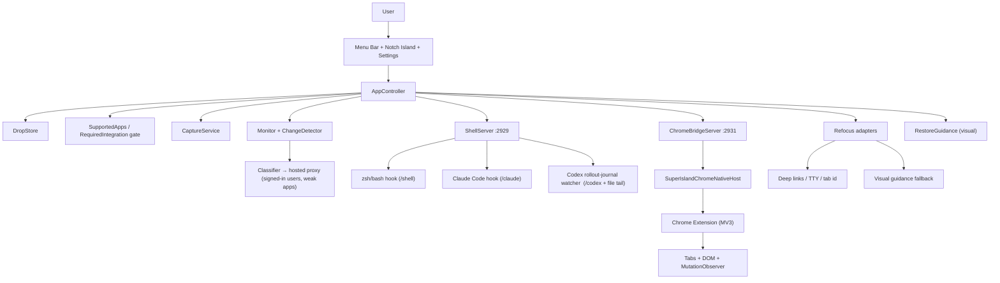

# SuperIsland Architecture and Feature Map

Updated: 2026-06-23 (supersedes the 2026-06-10 version, which predated the
supported-app allowlist and the Claude Code / Codex agent integrations, and
incorrectly renamed the `Drop` domain entity to "SuperIsland").

## Product Summary

**SuperIsland** is a native macOS menu-bar app for bookmarking in-progress work.
The captured bookmark is called a **drop**.

The user "drops" on the current app or browser tab, moves on, and later uses the
notch island or menu-bar list to return to the exact task. SuperIsland also
monitors the target and updates its status: working, done, needs attention,
stale, or unknown.

Unlike a generic window-bookmarker, SuperIsland only supports an **explicit
allowlist of apps it has a real integration for** (see Supported Apps). Dropping
on anything outside that set — or on a supported app whose integration isn't
installed — is refused with a toast, because a drop with no status source would
be a dead chip.

Strategy, in priority order:

1. Prefer strong, event-driven integrations (shell hooks, agent hooks/journals, Chrome extension).
2. Use app-specific adapters for precise refocus (Terminal, iTerm, editors).
3. Use generic visual guidance only as a user-confirmed fallback within supported apps.

## High-Level Architecture



## Code Layout

### `Sources/SuperIslandCore` — pure, testable domain logic (no AppKit)

- `Models.swift`: `Drop`, `DropStatus`, `WindowTarget`, `Locator`, `StatusEvent`, `ChromeTaskAnchor`.
- `DropStore.swift`: owns the drop list, persistence (JSON), ordering, status updates.
- `DropSource.swift`: a drop's origin badge (so the same app can show where the drop came from).
- `AlertLevel.swift`: how loudly a status change is announced (each level has one primary cue).
- `ChangeDetector.swift`: change-then-settle gating before evaluation.
- `Classifier.swift` + `ClaudeTranscript.swift`: Claude-backed status classification and transcript-tail parsing.
- `IntegrationRouter.swift`: classifies a drop's locator as `strong` / `appSpecific` / `generic`, and whether visual restore is allowed.
- `SupportedApps.swift`: the fixed allowlist + `RequiredIntegration` mapping (chrome / shell / claude / codex).
- `ClaudeHookSupport.swift` / `CodexHookSupport.swift`: event→status mapping, settings.json surgery (Claude), rollout-journal parsing (Codex), deep links.
- `AgentTerminalSupport.swift`: detects when a terminal is running an agent CLI (claude/codex) for labeling.
- `ChromeBridgeProtocol.swift` / `ChromeBridgeStateStore.swift` / `ChromeNativeHostManifest.swift` / `ChromeExtensionIdentity.swift`: Chrome bridge tools, in-memory tab state, native-host manifest generation, extension-ID derivation.
- `ShellHookScriptBuilder.swift`: generates the zsh/bash hook scripts and rc source blocks.
- `RestoreMemory.swift`: encrypted visual-restore memory model + anchor matching.
- `ContentURL.swift`: web-content URL comparison used as tab identity.
- `OnboardingFlow.swift`: ordered first-run steps (UI lives in the app target).
- `Hotkey*` (`HotkeyMatcher`, `HotkeyShortcutPolicy`, `HotkeyRegistrationDiagnostic`): global-hotkey logic.

### `Sources/SuperIslandApp` — the macOS app

- `SuperIslandApp.swift`: entry point, `MenuBarExtra`, Settings scene, Sparkle updater wiring.
- `AppController.swift`: central coordinator (drop, monitor, shell/agent events, Chrome bridge, restore, refocus).
- `Adapters.swift`: Chrome, Terminal, iTerm, Editor (Cursor/VS Code), and generic adapters + refocus.
- `ClaudeIntegration.swift` / `CodexIntegration.swift`: install/observe the agent integrations.
- `ShellServer.swift`: local HTTP receiver on `:2929`, routing `/shell`, `/claude`, `/codex`.
- `ShellIntegration.swift`: installs zsh/bash hooks into `~/.config/superisland/` + rc source blocks.
- `ChromeBridgeServer.swift` (`:2931`) / `ChromeIntegration.swift`: bridge server + extension/native-host setup.
- `Monitor.swift`, `CaptureService.swift`, `Permissions.swift`, `Settings.swift`, `HotkeyService.swift`, `ServicesProvider.swift`.
- `NotchIsland.swift`, `Views.swift`, `AlertBannerHost.swift`, `Onboarding/`: UI surfaces.
- `RestoreVisual.swift`: encrypted visual memory (AX/OCR anchors) + highlight overlay.
- `HookDebugLog.swift`: diagnostic log at `~/.config/superisland/hook-debug.log`.

### `Sources/SuperIslandChromeNativeHost`

Native-messaging helper: reads length-prefixed JSON from Chrome, forwards to
`http://127.0.0.1:2931/chrome`, polls for queued commands (e.g. `chrome.refocus_tab`),
and returns responses to the extension.

### `Extensions/Chrome` — Manifest V3 extension

`manifest.json` (pins the extension ID via the `key` field), `background.js`
(native messaging, tab-state capture, refocus, 1s command poll), `content.js`
(DOM summary + `MutationObserver` task hints).

## Domain Model

- **`Drop`**: `id`, `createdAt`, `label`, `target`, `status`, `lastChecked`, `history`, optional `restoreMemoryID`, source.
- **`WindowTarget`**: bundle id, app name, pid, CG window id, title snapshot, `Locator`.
- **`Locator`** (drives restore): `generic`, `chrome`, `terminal`, `iterm`, `shell`, **`editor`**.
- **`DropStatus`**: working / done / needsAttention / stale / unknown.

## Supported Apps (allowlist + integration gating)

`SupportedApps.bundleIDs` is the complete set; `RequiredIntegration` says what
each one needs. Dropping a supported app whose integration isn't installed is
refused with a toast, same as an unsupported app.

| App | Bundle ID | Required integration |
|---|---|---|
| Chrome / Chrome Canary / Brave | `com.google.Chrome`, `…Chrome.canary`, `com.brave.Browser` | `chrome` (extension bridge) |
| Terminal / iTerm2 | `com.apple.Terminal`, `com.googlecode.iterm2` | `shell` (hooks) |
| Cursor / VS Code | `EditorApp.cursor`, `EditorApp.vsCode` | `shell` (integrated-terminal hooks) |
| Claude Desktop | `com.anthropic.Claude` | `claude` (Claude Code hooks) |
| Codex | `com.openai.codex` | `codex` (rollout-journal watcher) |

## Integration Routing

`IntegrationRouter.strength(locator:bundleID:)`:

- **strong** — `.shell`, `.chrome` (and a Chrome bundle with a generic locator).
- **appSpecific** — `.terminal`, `.iterm`, `.editor` (+ those bundles).
- **generic** — everything else; the only tier where `allowsVisualRestore` is true.

## Drop Flow

1. User triggers Drop (notch island, menu bar, hotkey, or Services menu).
2. `AppController.createDrop()` first checks sign-in state; if the user is not
   signed in it shows a "Sign in to use SuperIsland" toast and opens onboarding.
3. If signed in, it checks `SupportedApps` / `RequiredIntegration`; an
   unsupported app or missing integration is refused with a toast.
4. Adapters identify the frontmost target and return a `WindowTarget` with the
   strongest available `Locator`.
5. For a generic locator with visual memory enabled, restore memory is captured
   (screenshot, window bounds, AX anchors, Vision OCR boxes), encrypted locally.
6. `DropStore` persists the drop; the island and menu list update immediately.

## Status / Monitoring by Integration

**Shell / terminal (`:2929` `/shell`).** Hooks `superisland.zsh` / `superisland.bash`
in `~/.config/superisland/` capture the TTY and POST `register` / `start` / `done`
(command, exit code, duration). Exit 0 → done; non-zero → needs attention. Works
across Terminal, iTerm, Warp, and editor integrated terminals because the signal
comes from the shell. Refocus matches the saved TTY to a window/pane via AppleScript.

**Claude Code (`:2929` `/claude`).** Installs `superisland-claude-hook.sh` and
registers it in `~/.claude/settings.json` (marker `superisland-claude-hook`) for
7 lifecycle events. `UserPromptSubmit`/`PreToolUse`/`PostToolUse` → working,
`Stop` → done, permission `Notification` → needs attention. Ambiguous turn-ends
are resolved from the transcript tail (`~/.claude/projects/…/<id>.jsonl`), using
Haiku when an API key is set, else a structural heuristic. Refocus via
`claude://session/<id>`.

**Codex (`:2929` `/codex` + file watching).** The Codex desktop app ignores
hooks, so SuperIsland tails its rollout journals
(`~/.codex/sessions/<y>/<m>/<d>/rollout-<ts>-<id>.jsonl`): `task_started` / `*_begin`
→ working, `task_complete` → done, "approval" events → needs attention. A drop is
bound to a session via `~/.codex/.codex-global-state.json` → `active-workspace-roots`.
Refocus via `codex://threads/<id>`.

**Chrome (`:2931`).** Extension → native host → `ChromeBridgeServer` →
`ChromeBridgeStateStore`. The extension captures tab identity + a DOM summary
(keyword heuristic for working/done/error) and a `MutationObserver` reports
changes. MCP-style tools: `chrome.list_tabs`, `chrome.capture_active_tab_state`,
`chrome.capture_tab_dom_summary`, `chrome.refocus_tab`, `chrome.observe_tab_task`,
`chrome.get_tab_status`. Refocus queues `chrome.refocus_tab` (the native host
polls); fallback is AppleScript, then generic window raise.

**Editor (Cursor / VS Code).** App-specific adapter: status comes from the
integrated terminal's shell hooks; restore uses file path + workspace, or the
terminal TTY when that's what's focused.

**Generic visual restore.** Only for `generic`-strength drops. At drop time it
stores AES-GCM-encrypted memory (window bounds, AX anchors, OCR boxes; key in
Keychain) at `~/Library/Application Support/SuperIsland/RestoreMemory/<id>.droprestore`.
On return it raises the window, scores current anchors vs. the saved set, and
shows a **user-confirmed** highlight over the best match. Not autopilot.

## Membership & Hosted Claude Proxy

### Sign-in requirement

SuperIsland requires the user to sign in before any drop can be created. This is
a hard wall: `AppController.createDrop()` checks `AuthService.isSignedIn` and
refuses with a "Sign in to use SuperIsland" toast — opening the onboarding sheet
— when the condition is false. `MenuBarContent` shows a locked sign-in prompt
when signed out. The onboarding flow (`OnboardingFlow`) has a required `signIn`
step that blocks progression until the user is authenticated.

### Authentication (Supabase, PKCE web flow)

Auth is handled by Supabase Auth. Google, Microsoft/Outlook (Azure AD), and Apple
are all supported via a single OAuth PKCE web flow using `ASWebAuthenticationSession`.
The app registers the `superisland://auth-callback` URL scheme; after the OAuth
redirect the system hands the callback back to the app.

`AuthService` (app target) drives the sign-in flow, persists the Supabase session
(access token + refresh token) in the Keychain under the account name
`supabase-session`, and refreshes the token before expiry. The public Supabase
project URL and anon key are embedded in `BackendConfig` (project ref
`dnybgtyvqflisttbhoqw`); no secret credentials ship in the app binary.

### Hosted Claude proxy (Edge Function `classify`)

Classification no longer calls `api.anthropic.com` directly from the client.
`ClaudeClassifier` (proxy mode) POSTs the client-built Anthropic Messages API
payload to the Supabase Edge Function `classify`, with the user's Supabase JWT
as the `Authorization: Bearer` token.

The Edge Function:

1. Validates the JWT via `auth.getUser` (the function sets `verify_jwt = false` in
   `config.toml` so the handler owns auth, but performs it explicitly).
2. Enforces a per-user daily quota atomically via the Postgres function
   `check_and_increment_quota` (table `usage_daily`, cap `DAILY_CALL_CAP`).
3. Checks the requested model against an allowlist.
4. Forwards the payload to `api.anthropic.com` using the owner's
   `ANTHROPIC_API_KEY`, which is a server-side secret — it is never embedded in
   the app.

A 429 response means the user has hit their daily cap; the app surfaces this as
"Daily limit reached (used/cap)". The response headers `x-quota-used` and
`x-quota-cap` carry the current numbers.

**Request flow:**

```
App (ClaudeClassifier) → POST /functions/v1/classify + Bearer <JWT>
    ↓ Supabase Edge Function
    → auth.getUser(JWT)          [validate caller]
    → check_and_increment_quota  [atomic quota check, Postgres]
    → POST api.anthropic.com/v1/messages + ANTHROPIC_API_KEY (server secret)
    ↑ streamed/batched response back to app
```

### Server-side code

The Supabase backend lives in `supabase/` at the repo root:

| Path | Purpose |
|---|---|
| `supabase/migrations/0001_profiles_and_quota.sql` | `profiles` + `usage_daily` tables, `check_and_increment_quota` function |
| `supabase/functions/classify/handler.ts` | Edge Function — auth, quota, proxy |
| `supabase/functions/classify/index.ts` | Deno entry point |
| `supabase/tests/quota_test.sql` | pgTAP quota unit tests |

Deployment is automated by `.github/workflows/supabase-deploy.yml` (pushes to
`main` deploy the Edge Function to the linked Supabase project).

## Local Servers, Ports, and File Paths

Sign-in is required before any drop can be created (see Membership & Hosted
Claude Proxy). Classification is routed through the Supabase hosted proxy
(`https://dnybgtyvqflisttbhoqw.supabase.co/functions/v1/classify`) rather than
calling Anthropic directly; no Anthropic API key is stored on-device.

| Service | Port | Routes |
|---|---|---|
| `ShellServer` | **2929** | `/shell`, `/claude`, `/codex` |
| `ChromeBridgeServer` | **2931** | `/chrome` (events + tool calls) |

| Path | Purpose |
|---|---|
| `~/.config/superisland/superisland.zsh` / `.bash` | shell hooks |
| `~/.config/superisland/superisland-claude-hook.sh` | Claude Code hook |
| `~/.config/superisland/hook-debug.log` | hook delivery diagnostics |
| `~/.claude/settings.json` | Claude hook registration |
| `~/.codex/sessions/…/rollout-*.jsonl`, `.codex-global-state.json` | Codex status + focus |
| `~/Library/Application Support/Google/Chrome/NativeMessagingHosts/com.superisland.chrome_bridge.json` | native host manifest |
| `~/Library/Application Support/SuperIsland/` | drop store JSON + encrypted restore memory |

## User-Facing Features

- **Menu-bar agent** (no Dock icon): active drops, status, refocus, rename/dismiss, settings.
- **Notch island**: borderless always-on-top chips; color/animation convey status; click to return.
- **Alert levels** (`AlertLevel`): status changes are surfaced at calibrated loudness.
- **Global hotkey** + **Services menu** for dropping on the frontmost app.
- **Onboarding** (`OnboardingFlow`): guided first-run including sign-in (required), permissions, and integration setup.
- **Permissions**: Screen Recording, Accessibility, Automation/Apple Events.
- **Settings → Integrations**: install/enable shell, Claude, Codex, and Chrome integrations; "Check for Updates…".

## Distribution & CI/CD

- **Repo**: github.com/akkhil7/superisland (public). **Auto-update**: Sparkle 2.x;
  appcast at `https://akkhil7.github.io/superisland/appcast.xml`.
- **CI** (`.github/workflows/ci.yml`): secret-free gate on PR/main (build, test,
  SwiftLint + swift-format strict, ad-hoc signing dry-run) on `macos-15`.
- **Release** (`.github/workflows/release.yml`): push tag `vX.Y.Z` →
  version-inject → Developer ID sign (incl. embedded Sparkle.framework and the
  secondary `SuperIslandChromeNativeHost`, hardened runtime) → notarize + staple
  (`Scripts/package-dmg.sh`) → Sparkle-sign the DMG → GitHub Release → append
  appcast item on the `gh-pages` branch. First release: v0.1.0.

## Build and Run

```sh
swift build           # build package
swift test            # 138 tests
Scripts/build-app.sh release   # assemble .build/SuperIsland.app (Developer ID or ad-hoc)
open .build/SuperIsland.app
```

## Known Gaps and Next Steps

- Chrome extension is still a developer-style unpacked install.
- DOM/agent task detection is heuristic; could become more site/agent-specific.
- Visual restore is a single-anchor suggestion, not a multi-step navigator.
- App-level UI automation tests are not yet in place.
- More strong adapters possible later (Safari, Slack, Linear, Notion, …).
- CI actions (`checkout@v4`, `import-codesign-certs@v3`) still target Node 20 (deprecation warning).

## Design Principle

SuperIsland feels seamless because it uses the best available truth source per
app — shells report command start/finish, agent hooks/journals report turn
state, Chrome reports tab/DOM state, app adapters return precisely, and visual
guidance helps only when nothing stronger exists.
